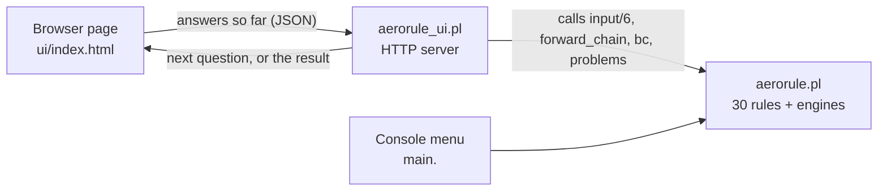

<div align="center">

# ✈️ AeroRule

**A rule-based expert system that checks whether a planned flight is legal to depart.**

Written in SWI-Prolog · 30 rules, each tied to a paragraph of 14 CFR Part 91 · forward chaining, backward chaining and full explanations · console menu **and** browser interface

<sub>Assignment 2 · CM3321 Logic Programming and Artificial Cognitive Systems · University of Moratuwa</sub>

</div>

> ⚠️ **Study project.** Please don't use it to plan a real flight.

---

## What it does

You describe a flight: airspace, weather, fuel. AeroRule tells you whether it is legal to depart under the parts of the US flight rules that are modelled:

| Area | Regulation |
|---|---|
| VFR weather minimums | 14 CFR 91.155 |
| Special VFR | 14 CFR 91.157 |
| IFR alternate-airport rule (the 1-2-3 test) | 14 CFR 91.169 |
| Fuel reserves, VFR and IFR | 14 CFR 91.151, 91.167 |
| VFR in Class A | 14 CFR 91.135 |

I picked this field because the rules already exist in writing, so nothing had to be made up. Every rule points to the paragraph it comes from, and [`RULES.md`](RULES.md) has the eCFR links.

**Two ways to reason**

- **Forward chaining.** You answer the questions, the engine fires every rule it can and explains the result.
- **Backward chaining.** You pick a question ("is an alternate required?"), the engine works back from it and asks only for the facts it needs.

**Explanations.** A refused flight comes with the reason, the rule and the regulation. Every result comes with the rules that fired and a tree showing how the conclusion was reached, including the numbers compared.

## What's in the repository

| File | Contents |
|---|---|
| [`aerorule.pl`](aerorule.pl) | The whole expert system in one file: questions, 30 rules, both inference engines, explanations, console menu and the 98 tests |
| [`aerorule_ui.pl`](aerorule_ui.pl) | The web interface server. It loads `aerorule.pl` unchanged and calls its own predicates, so the rules exist in one place only |
| [`ui/index.html`](ui/index.html) | The web page (one file, no libraries, works offline) |
| [`RULES.md`](RULES.md) | Every rule in plain words with its source and link, the list of facts and the assumptions |
| [`TESTS.md`](TESTS.md) | Results of the 98 automatic tests and how the system was checked |

## Quick start

You only need **[SWI-Prolog](https://www.swi-prolog.org/Download.html)** (stable release). No packages to install.

### 🌐 Browser interface

```bash
swipl -g ui_start aerorule_ui.pl
```

Your browser opens at <http://localhost:8080/>. Press `Ctrl+C` in the terminal to stop. The server listens on `localhost` only.

To use another port, without opening the browser:

```bash
swipl -g "ui_start(9000)" aerorule_ui.pl
```

The page has four tabs:

| Tab | What you get |
|---|---|
| **Consultation** | One question at a time, buttons for choices, a **Why do you ask?** box on every question, a live list of your answers, **Back** and **Start over**. The result shows the verdict, why not, every rule fired in order, and the explanation tree |
| **Ask one question** | Backward chaining. Pick a goal, answer only what it needs, read the proof |
| **Rules** | All 30 rules as IF / THEN, searchable, with the regulation links |
| **Tests** | Runs the 98 built-in tests and shows every line |

Three ready-made examples on the side of the page fill in a whole flight for you. Light and dark themes both work, and it fits a phone screen.

### ⌨️ Console menu

```bash
swipl aerorule.pl
```

then, at the `?-` prompt:

```prolog
?- main.
```

On Windows you can also double-click `aerorule.pl`, or open SWI-Prolog and use **File > Consult...**. The full stop after `main` is needed, because this is a Prolog command.

```
1. New consultation (forward chaining, full explanation)
2. Ask one question (backward chaining)
3. List the 30 rules and their sources
4. Run the built-in test cases
5. Exit
```

- Type your answer and press Enter: `vfr`, `3.5`, `yes`. A full stop at the end is optional, and capital letters are fine.
- Type `why` at any question to see why it is asked and which rules use the answer.
- Type `none` when there is no ceiling or no cloud nearby.
- Type `quit` to stop a consultation and go back to the menu.

### 🧪 In SWISH (console version only)

1. Open <https://swish.swi-prolog.org/> and click **Program**.
2. Paste the whole content of `aerorule.pl` into the left pane.
3. Type `main.` in the query box and press **Run!**.

I checked the code against SWISH's security rules (see [`TESTS.md`](TESTS.md)), but I have not tried it on the SWISH website itself. If something doesn't work there, please use the local installation. The browser interface needs a local installation.

## Try this example

Class D airport, poor weather, Special VFR clearance in hand. In the browser use the first example button, or answer like this in either interface:

| Question | Answer |
|---|---|
| VFR or IFR | `vfr` |
| Airspace class | `d` |
| Altitude MSL | `3000` |
| Night | `no` |
| Inside surface area | `yes` |
| Taking off / landing | `yes` |
| Flight visibility | `2` |
| Ceiling | `800` |
| Ground visibility reported | `yes` |
| Ground visibility | `1.5` |
| In cloud | `no` |
| Cloud above / below / horizontal | `none`, `none`, `none` |
| Between sunrise and sunset | `yes` |
| Special VFR prohibited here | `no` |
| ATC Special VFR clearance | `yes` |
| Minutes to destination | `90` |
| Minutes of fuel on board | `150` |

Expected result: ✅ **LEGAL TO DEPART**. The trace shows that 2 SM is below the Class D minimum of 3 SM (r04, r12), that the ceiling and airport visibility are too low (r14, r15), that Special VFR is therefore possible (r16) and authorised (r17), that the fuel is enough (r26), and finally the verdict (r29).

Answer `no` to the ATC clearance question instead and the result is ⛔ **NOT LEGAL**. The report then shows which Special VFR condition failed.

## How it fits together



The browser keeps the list of answers. Each request sends the whole list, the server loads it as facts, lets the engine work, and replies with the next question or the final result. Nothing is stored between requests. Answers are checked by the engine's own validation, so `y`, `3.5` and `none` mean the same as at the console.

## Running the tests

Engine tests, no typing needed:

```bash
swipl -q -g run_tests -t halt aerorule.pl
```

The last lines should read:

```
98 of 98 tests passed
rules triggered at least once: 30 of 30
```

Web-interface check. It plays all 41 scenarios through the code the web page uses, once by forward and once by backward chaining, and compares each verdict with the expected one:

```bash
swipl -q -g ui_selftest -t halt aerorule_ui.pl
```

The last line should read:

```
41 of 41 web-interface checks passed
```

## Limits

Airplanes only (no helicopters). Some exceptions in the regulations are not modelled, for example the night traffic-pattern exception in 91.155(b), and ATC's freedom to refuse Special VFR. The full list is at the end of [`RULES.md`](RULES.md).
